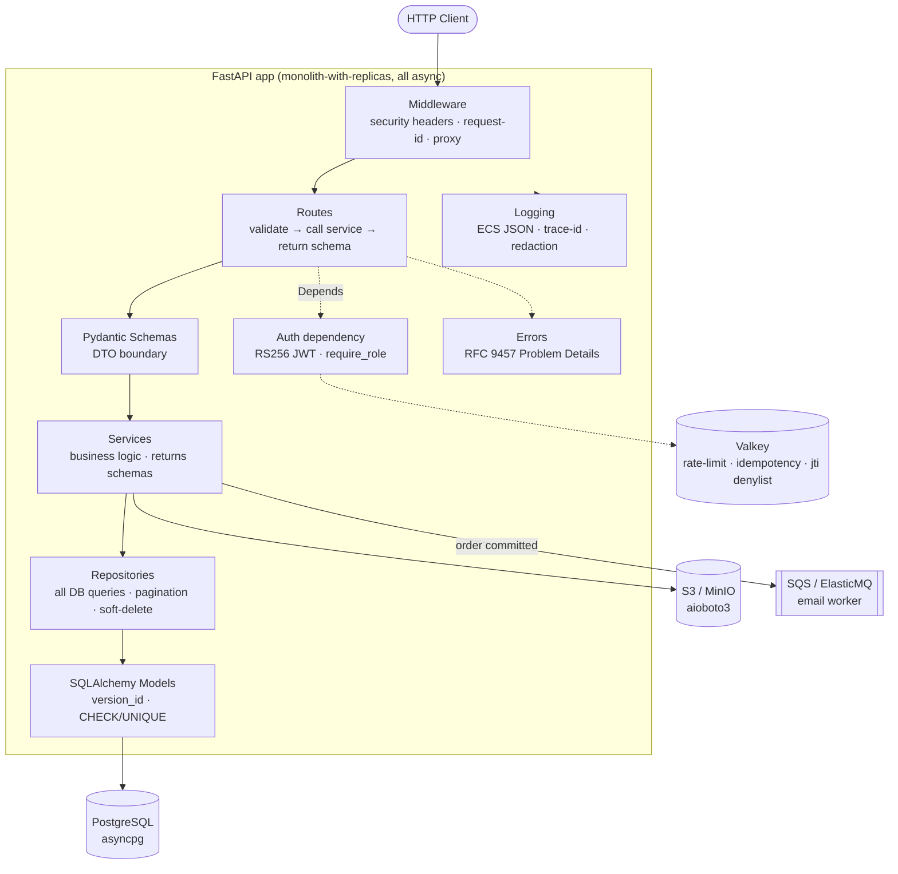

# Architecture

Async, API-first FastAPI e-commerce backend. **Monolith-with-replicas**: one
deployable service with a shared auth dependency across routers, run as multiple
identical ECS Fargate tasks behind an ALB. RS256 JWT keeps a future auth-service
split free.

## Layered layout (`src/`)

```
src/
├── config/        # pydantic-settings (setting.py) + ECS JSON logging (logging.py)
├── clients/       # async infra clients (postgres, valkey, s3)
├── models/        # SQLAlchemy ORM models
├── repositories/  # all DB queries live here — routes/services never query directly
├── services/      # business logic; returns response schemas, never ORM models
├── routes/        # thin: validate (Pydantic) → call service → return response model
├── middleware/    # security headers, request-id, proxy headers
├── errors/        # RFC 9457 Problem Details (error_builder.py, exception_handlers.py)
├── admin/         # admin-only surface
└── container.py   # DI wiring: repositories/services instantiated once, injected via Depends
```

**Request flow — do not skip layers:** `Route → Schema → Service → Repository → Model`.



## Async is a top-to-bottom contract (the #1 risk)

Every route, service, and repository is `async def`. A single blocking sync call
in an async path silently serializes that endpoint under load. Offload
unavoidable blocking/CPU-bound work with `run_in_threadpool` /
`asyncio.to_thread`: Argon2 hashing (Phase 5), Pillow re-encode + `python-magic`
sniff (Phase 7), sync `boto3`. Use `asyncio.sleep()`, never `time.sleep()`.
**Alembic stays sync** (sync `psycopg` driver in `env.py`).

## Auth / JWT model

- Short-lived **access token** (10–15 min) in an **httpOnly + Secure + SameSite
  cookie**; longer-lived **refresh token, rotated on every `/refresh`** (old
  `jti` revoked).
- **RS256**, verify algorithm hardcoded (`alg:none` guard), verified with the
  **public key** only. Issuer holds the private key.
- Roles/scopes (`customer`, `vendor`, `admin`) live in the token payload → RBAC
  is a cheap `Depends(require_role(...))`, not a DB hit.
- Revocation via **Valkey `jti` denylist** (TTL = token remaining life) + a
  per-instance in-memory LRU shortcut. Add `jti`s on logout, password change,
  role change.
- **Privilege guard:** registration never accepts `role` from input (default
  `customer`); OAuth logins auto-create a `customer`.

## Valkey usage

Ephemeral shared state **only**: rate-limit counters, idempotency keys, JWT
`jti` denylist. Prod = ElastiCache for Valkey replication group (Multi-AZ) so the
one shared dependency isn't a SPOF. Not for sessions/caching (product-listing
read cache is a later watch-item).

## Domain events

In-process `async def` handlers invoked with `await handler(order)` on order
commit — **not blinker** (sync, can't await an async SQS enqueue). Inventory
adjust stays inside the transaction; email confirmation is **enqueued to SQS**
(ElasticMQ locally) and drained by one small worker with retry. **Never
`BackgroundTasks` for durable work.**

## Correctness invariants (never simplify away)

- **Optimistic locking** on inventory via `Product.version_id` — prevents
  overselling.
- **Idempotent checkout**: `UNIQUE(user_id, idempotency_key)` on `Order` is the
  durable guard (Valkey only short-circuits fast retries).
- DB constraints belong in the DB: `UNIQUE(email)`, `CHECK(price > 0)`,
  `CHECK(stock >= 0)`, explicit `ON DELETE`.
- Uploads validated at the trust boundary: sniff real bytes (`python-magic`),
  re-encode images (Pillow) to strip EXIF.

## Errors, logging, security

- Errors: **RFC 9457 Problem Details** built via `src/errors/error_builder.py`.
- Logging: ECS JSON to stdout, `contextvars` trace-id, `RedactFilter` scrubs
  secrets/PII. Never log passwords/tokens/JWT claims/PII.
- Security headers via custom ASGI middleware (HSTS, CSP, `X-Content-Type-Options`,
  `X-Frame-Options`). CSRF = `SameSite` cookie + double-submit token on
  state-changing routes. CORS = explicit allow-list with `allow_credentials=True`.

## Extension points

- New resource = add model → repository → service → router, wired in
  `container.py`. Layers keep the change local.
- Auth-service split: RS256 verification needs only the public key, so a separate
  issuer can be introduced without touching verifiers.
- Read cache / search / additional workers are additive behind the existing
  service boundary.

## Deploy target

Docker image → ECR (tagged by git SHA, not `latest`) → **ECS Fargate**, behind an
ALB, multiple identical tasks. Alembic runs as a one-off migration task, not at
app boot. Terraform is the IaC. See [`DEPLOYMENT.md`](DEPLOYMENT.md).
