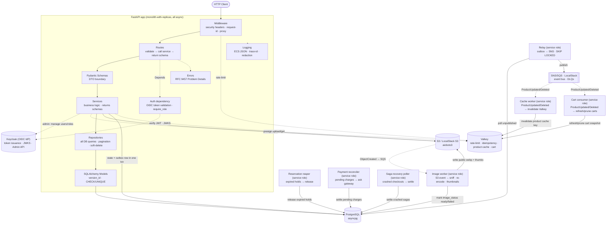

# Architecture

Async, API-first FastAPI e-commerce backend. **Monolith-with-replicas**: one
deployable service with a shared token-validation dependency across routers, run
as multiple identical ECS Fargate tasks behind an ALB. Identity is externalized
to **Keycloak (OIDC)**, so a future auth-service split is essentially free.

## Layered layout (`src/`)

**Modular monolith, microservices-ready**: one deployable service split into
modules with hard boundaries — **schema-per-module, no cross-module DB joins,
no cross-module ORM/domain imports** (enforced by `import-linter` via
`.importlinter`). Modules communicate in-process now, and through **events**
later; extraction to microservices is documented in an ADR, not built.

```
src/
├── shared/        # thin shared kernel: config (pydantic-settings) + ECS JSON logging,
│                  #   RFC 9457 errors, middleware, auth (JWKS/Principal), db/valkey/s3
│                  #   clients, outbox bus + relay, container.py (DI composition root)
├── catalog/       # api/ application/ domain/ ports/ adapters/ — schema: catalog
├── inventory/     # reservations, atomic decrement, reaper — schema: inventory
├── orders/        # order aggregate + checkout saga + saga_log — schema: orders
├── payments/      # stub gateway, webhook, reconciliation poller — schema: payments
├── identity/      # User (OIDC sub), JIT provisioning — schema: identity
├── cart/          # pre-checkout basket, Valkey-only (no Postgres schema)
└── events/        # versioned JSON-Schema event contracts (registry + models)
```

Within a module, dependency flow is **api → application (use-cases) → domain →
ports ← adapters (db/s3/bus/gateway)**. The domain imports nothing outward;
ports/adapters exist only at varying edges. **Request flow — do not skip
layers:** `Route → Schema → Service → Repository → Model`. Services return
Pydantic schemas, never ORM models; all DB queries live in the module's
`adapters/db`. Cross-module calls (the saga → inventory/payments/cart) go
through the calling module's **own ports**, implemented at the composition root
(`src/shared/container.py`) — never a sibling import.



## Async is a top-to-bottom contract (the #1 risk)

Every route, service, and repository is `async def`. A single blocking sync call
in an async path silently serializes that endpoint under load. Offload
unavoidable blocking/CPU-bound work with `run_in_threadpool` /
`asyncio.to_thread`: Pillow re-encode + `python-magic` sniff (Phase 7), sync
`boto3`. Use `asyncio.sleep()`, never `time.sleep()`.
**Alembic stays sync** (sync `psycopg` driver in `env.py`).

## Auth model (OIDC resource server)

The app is a **pure OIDC resource server** — it never handles credentials or
login flows. **Keycloak** is the Identity Provider (free/OSS; a container locally,
a deployed service in any env). A separate frontend/SPA runs Authorization Code +
PKCE against Keycloak; the API only validates the tokens Keycloak issues.

- **Validate-only**: verify the Keycloak **RS256** access token against Keycloak's
  cached **JWKS** (`iss`/`aud`/`exp`), algorithm hardcoded (`alg:none` guard),
  public key only. Bearer token in the `Authorization` header → **no auth cookie,
  no CSRF surface**.
- **Two-tier principal**: `get_current_user` verifies the
  token and returns a claims-only `Principal(sub, email, roles)` — **no DB hit**;
  `get_current_db_user` does JIT + `is_active` and is wired only into routes needing
  the local `users.id`. A process-wide `PyJWKClient` (built in the lifespan) caches
  keys; its blocking fetch runs via `run_in_threadpool`, with a short timeout and a
  coalesced, rate-limited refresh so unverified `kid`s can't amplify onto Keycloak.
  JWKS unreachable **or unusable** (bad JSON, empty/malformed key set) → **503**;
  bad/expired/tampered token, or an unknown `kid` against a usable key set → **401**
  (`WWW-Authenticate: Bearer`).
- **Roles** (`consumer` / `merchant` / `admin`, plus a `service` machine role) are
  **Keycloak realm roles** in the token (`realm_access.roles`) → RBAC is a cheap
  `Depends(require_role(...))` claim check on `Principal`, not a DB hit. Keycloak is
  the single source of truth for roles. `realm_access.roles` is validated as a **list
  of strings** (and `email` as a string) before use — a loose parse would let
  `{"roles": {"admin": true}}` grant privileges; anything else → **401**.
- **Local `users` row keyed by the OIDC `sub`**, JIT-provisioned race-safely
  (`INSERT ... ON CONFLICT (oidc_sub) DO UPDATE ... RETURNING`) on first
  authenticated request, anchors FK ownership (`products.merchant_id`,
  `orders.user_id`) + an `is_active` mirror — not the identity/role source. A
  disabled local row → **403**.
- **Row-level ownership** is enforced in the **service layer**: a `merchant` may
  mutate/soft-remove only items where `merchant_id == user.id`; the `admin` role
  **bypasses ownership** (but does not auto-satisfy an explicit `require_role`
  gate); `consumer` reads + orders.
- **Admin identity management** via Keycloak's **Admin API** (`python-keycloak`):
  create/disable users, grant/revoke the `merchant` role. The app stores no
  passwords.
- **Revocation = short access-token TTL (~5 min)** — a disabled user's token
  expires fast; no app-side denylist/introspection. Keycloak owns login, refresh,
  logout, password reset, email verification, MFA, and social federation.
- **Privilege guard is automatic**: new users get the default `consumer` realm
  role from Keycloak; the app cannot be asked to mint a role.
- **Realm layout** (`keycloak/realm-export.json`, imported by compose): clients
  `ecommerce-api` (bearer-only — exists so tokens can carry `aud: ecommerce-api`,
  added by an `oidc-audience-mapper` on the token-issuing clients), `ecommerce-spa`
  (public, PKCE + direct grants locally), `ecommerce-admin` (service account with
  `realm-management` `view-realm`/`view-users`/`manage-users` for the Admin API),
  and `ecommerce-worker` (service account holding the `service` realm role, the
  only principal that satisfies `GET /v1/internal/whoami`). Realm roles are
  `consumer`/`merchant`/`admin`/`service`; the defaults for a new user come from the
  composite `default-roles-ecommerce` (KC 26 shape), which includes `consumer`.
  `KEYCLOAK_AUDIENCE` must match the audience mapper or every request is `401`.
  Compose pins **one canonical issuer** (`KC_HOSTNAME`) so host/browser and
  in-network callers get the same `iss`; JWKS and the Admin API
  (`KEYCLOAK_SERVER_URL`) use the internal hostname.

## Valkey usage

Ephemeral shared state: rate-limit counters, checkout idempotency fast-path
records, event-dedup keys, the **product read-cache**, and **cart state** (no
JWT `jti` denylist — Keycloak + short token TTL own revocation; JWKS caching is
a process-wide `PyJWKClient`, not Valkey). Prod = ElastiCache for Valkey
replication group (Multi-AZ) so the one shared dependency isn't a SPOF.

### Product read-cache (cache-aside)

Single-product reads (`GET /products/{id}`) are cached aside under `product:{id}`
(the serialized `ProductResponse`). On a miss, a `SET NX` **fill-lock**
(`product:lock:{id}`, held with a unique token and released by compare-and-delete
so a caller can never delete another's re-acquired lock) elects one caller to read
the DB and populate the cache; that caller **re-checks the cache after acquiring
the lock** (double-checked fill), **renews the lock while it reads the DB** so even
a slow fill never lets the lock lapse and a second filler start, and concurrent
callers **wait while the lock is held** rather than racing the DB — so a hot key
never stampedes the DB, and there is no fixed waiter timeout that could permit a
duplicate read on a legitimately slow fill. Entries carry a **jittered TTL**
(`ttl + rand(0..jitter)`) so co-populated keys don't expire in lockstep.
Invalidation is **event-driven**: the `catalog-cache` consumer subscribes
`ProductUpdated`/`ProductDeleted` and evicts the key (idempotent — a `DELETE` of
an absent key is a no-op). Product edits *and* image-state changes both feed this:
the image worker's `mark_image_ready`/`mark_image_failed` emit `ProductUpdated`
through the same transactional outbox (in the txn that flips the image state), and
starting a re-upload (`ready` → `pending`) emits it too, so a newly-ready image's
`image_url` never lingers stale behind a cached response. Image transitions are
guarded on `image_status = 'pending'`, so a redelivered worker event can't emit a
duplicate invalidation. Invalidation and a concurrent fill are serialized by the
**fill lock itself**: invalidation atomically deletes the cached value *and the
lock*, and the filler stores only while it still owns the lock (compare-and-set) —
so a fill that began before an update finds its lock gone and its stale read is
dropped, with no separate (expiring, hence racy) generation counter. A confirmed
404 is **negative-cached** under a short-TTL tombstone so a burst of misses on an
absent id doesn't stampede the DB; a cache entry that no longer deserializes is
evicted and refilled rather than silently degrading every read. If Valkey is
unavailable the read **degrades to a direct DB read** rather than erroring. The
listing hot path stays uncached. Staleness is bounded by the relay poll + the
entry TTL.

## Checkout saga (orchestrated)

Checkout is an **orchestrated saga** (`src/orders/application/checkout_saga.py`),
not choreography: one state machine drives a cart to exactly one terminal order
(`paid` or `cancelled`). **Order-first**: the saga creates the `pending` order
(to anchor reservations and the idempotency guard), reserves each line through
the inventory service, charges through the payments service, commits the holds,
then marks the order `paid` — journaling every step to the persisted
**`saga_log`** as it goes. Each step has a compensating action (release holds +
cancel order); only unpaid sagas compensate — a `paid` order unwinds via the
future returns/refunds reverse saga, never via cancel.

- **Idempotency rides two layers.** The Valkey fast path
  (`idempotency:{user_id}:{key}`, holding `{body_hash, status, response}`)
  answers exact replays without touching Postgres; **`UNIQUE(user_id,
  idempotency_key)`** plus the stored `idempotency_body_hash` is the durable
  truth that survives Valkey eviction. Same key + same body replays the stored
  response; same key + different body → **409** — at either layer. Valkey
  faults degrade to a miss (the DB backstop still guards), never fail checkout.
  The hash covers the payment token (the cart is server-side, and a completed
  checkout clears the cart, so hashing cart lines would 409 every exact retry);
  the token itself is never stored.
- **Recovery, not re-presentation.** A crash between steps leaves a `pending`
  order with holds against it. The `service`-role **saga recovery poller**
  (`src/shared/saga_recovery.py`) claims `pending` orders older than the saga
  step timeout (`FOR UPDATE SKIP LOCKED`, so N replicas split the batch) and
  settles each from its **payment row's terminal state** — commit + mark paid
  when the charge succeeded, release + cancel otherwise. It never re-presents
  the payment token (which is never stored); still-`pending` payments are left
  for the payment reconciler. It lives in `shared` deliberately: settling
  composes four modules, and only shared code may do that.
- **Timeouts are relationships, enforced at startup**: the per-step saga
  timeout (`CHECKOUT_SAGA_STEP_TIMEOUT_SECONDS`) must stay below
  `RESERVATION_TTL_SECONDS`, so a live checkout can't lose its stock to the
  reaper mid-saga.
- **Cross-module calls go through the saga's own ports**
  (`src/orders/ports/checkout.py`), implemented at the composition root over
  the inventory/payments/cart services — the saga module never imports a
  sibling module.

## Domain events

Published through a **transactional outbox → SNS/SQS bus** (see ADR 0007), never
`BackgroundTasks` and never a direct SNS publish from the request path. The domain writes state
and an `outbox` row in **one transaction**; a `service`-role **relay** claims unpublished rows
(`FOR UPDATE SKIP LOCKED`), publishes them to SNS (**topic per event type**, **standard**
queues), then marks them published — publish-then-mark, so a crash re-ships (at-least-once).

Each consumer reads its own SQS subscription and is **idempotent**: it dedupes on the envelope
`event_id`, namespaced by its own consumer identity (`event:{consumer}:{event_id}`, so fan-out
subscribers never dedupe each other away), in Valkey (best-effort, ~24h TTL) backed by an
idempotent DB write, giving
**effectively-once** processing. Poison messages land in a **per-subscription DLQ** after N
retries (replay via SQS redrive — see RUNBOOK). W3C `traceparent` rides as an SQS message
attribute so one trace spans the queue hop.

**Dedup is not ordering.** Standard SNS/SQS makes no ordering promise and the relay publishes a
batch **concurrently**, so a consumer can see an older `ProductUpdated` *after* a newer one — or
after the `ProductDeleted`. `event_id` dedup only suppresses exact redeliveries, and
`schema_version` versions the *contract*, not the *instance*. Product events therefore carry
`data.product_version` — the catalog aggregate's `version_id` **after** the write that emitted
them, bumped by the ORM optimistic lock on edits/deletes and by hand in the raw image-flip
`UPDATE`s. A consumer that holds product state must record the last applied version per product
and **drop any event whose `product_version` is not greater**, treating `ProductDeleted` as a
**tombstone** at its own version so a slower in-flight update cannot resurrect it. The
`catalog-cache` worker is exempt by construction: it only *evicts* a key, and an eviction is
order-insensitive (the next read repopulates from Postgres).

That counter arrived as **`schema_version: 2`** of the three product events, not as an edit to
v1. Payloads are `extra="forbid"`, so adding a required field in place would fail both ways — a
v1 message already in an outbox row or an SQS queue would no longer validate, and a v1 consumer
would reject the new field — and a failed handler redrives to the DLQ. Producers emit v2; the v1
models stay in `EVENT_MODELS` so in-flight v1 messages still validate, and are droppable once
no v1 message can remain (queue retention plus any DLQ replay window). That is the worked
example of the versioning rule: **new `Literal` subclass, both versions registered.**

Registering both versions makes the change compatible in one direction only — new code reads
old messages, but old code still can't read new ones (an unregistered `(type, schema_version)`
is an `UnknownEventError`, and a raising handler redrives to the DLQ). So the rollout order is
part of the contract: **consumers first, producers last** — deploy every bus reader (today
just the cache worker) onto the version-capable image, let it stabilize, and only then the
services that emit: the API **and the image worker**, which consumes plain S3 notifications
but writes `ProductUpdated` rows on `image_status` flips. The relay is version-agnostic
(opaque rows, no validation). Roll back in the mirror order. `PRODUCED_VERSIONS` in
`src/events/registry.py` pins what
producers put on the wire and a test fails if the code drifts from it, so the producer half of
a bump is always an explicit diff. Procedure: `docs/DEPLOYMENT.md` § "Rolling out a new event
version"; recovery if it's violated: `docs/RUNBOOK.md` § 4.

## Workers (service role)

All long-running workers are separate `service`-role processes — ECS tasks in
prod, compose services locally — never `BackgroundTasks`:

- **Outbox relay** (`src.shared.bus.relay`): claims unpublished outbox rows
  (`FOR UPDATE SKIP LOCKED`) → publishes to SNS.
- **Image worker** (`src.catalog.adapters.image_worker`): S3 ObjectCreated →
  sniff / re-encode / thumbnails → marks the image ready/failed (emitting
  `ProductUpdated` through the outbox).
- **Catalog cache worker** (`src.catalog.adapters.cache_worker`): drains
  `ProductUpdated`/`ProductDeleted` → evicts the product read-cache key.
- **Cart consumer** (`src.cart.adapters.cart_consumer`): drains the same
  product events → refreshes/prunes Valkey cart snapshots (pure Valkey, no DB).
- **Reservation reaper** (`src.inventory.adapters.reaper`): releases stock
  holds past `expires_at`. Cron-style loop locally; EventBridge-scheduled
  `--once` ECS task in prod.
- **Payment reconciler** (`src.payments.adapters.reconciler`): charges still
  `pending` past their grace window are asked about at the gateway directly
  (the missed-webhook backstop; same guarded transitions as the webhook).
- **Saga recovery poller** (`src.shared.saga_recovery`): settles checkout
  orders still `pending` past the saga step timeout (see Checkout saga).

## Correctness invariants (never simplify away)

- **Atomic conditional decrement** on inventory (see ADR 0010) — the single
  `UPDATE ... WHERE on_hand - reserved >= :qty` *is* the oversell guard
  (`rowcount = 0` = rejected). The reservation row and its `StockReserved` outbox
  row commit in the **same transaction**. Never replace it with read-then-write,
  a row lock held across the request, or a Valkey lock.
- **Reservation TTL + reaper**: every hold carries `expires_at`; the `service`-role
  reaper releases expired holds so a stalled saga can't leak stock into a phantom
  oversell-block. Keep `RESERVATION_TTL_SECONDS` longer than the saga's step
  timeouts. `commit_reservation` (payment succeeded) is what stops the reaper
  releasing a *paid* order's stock.
- **Optimistic locking**: `Inventory.version` (manual CAS) and `Product.version_id`
  (ORM-managed) — two mechanisms on purpose, don't unify them.
- **Idempotent checkout**: `UNIQUE(user_id, idempotency_key)` on `Order` —
  composite, not global on the key alone, so one user's key can't block another
  user's identical key — is the durable guard, with `idempotency_body_hash`
  answering "same key, different body → 409" even after the Valkey fast-path
  record is evicted; a live hold is likewise unique per `(order_id, sku)`.
- DB constraints belong in the DB: `CHECK(price > 0)`,
  `CHECK(on_hand >= 0)`, `CHECK(reserved <= on_hand)`, explicit `ON DELETE`.
  The identity mirror is keyed by `UNIQUE(oidc_sub)` and deliberately carries
  **no `UNIQUE(email)`** — Keycloak owns email uniqueness, and only among
  *current* accounts, so a recreated account must become a new principal rather
  than inherit the previous holder's orders/products.
- Uploads validated at the trust boundary: sniff real bytes (`python-magic`),
  re-encode images (Pillow) to strip EXIF.

## Errors, logging, security

- Errors: **RFC 9457 Problem Details** built via `src/shared/errors/error_builder.py`.
- Logging: ECS JSON to stdout, `contextvars` trace-id, `RedactFilter` scrubs
  secrets/PII. Never log passwords/tokens/JWT claims/PII.
- Metrics: `/metrics` serves the Prometheus registry — **RED per endpoint**
  (`http_requests_total` / `http_request_duration_seconds`, labeled by route
  *template*, 404s as `unmatched`) plus domain counters: checkout outcomes
  and compensation (`checkout_attempts_total`, `checkout_compensation_total`),
  inventory oversell/reaper (`inventory_oversell_blocked_total`,
  `inventory_reaper_released_total`) and **outbox lag**
  (`outbox_lag_seconds{schema}`, measured from the DB so the alert signal
  outlives a dead relay). Worker-process counters
  (`checkout_recovery_total` in the saga-recovery worker; the reaper's
  releases) are exported via each worker's `WORKER_METRICS_PORT`, or a
  Pushgateway for short-lived `--once` runs (see RUNBOOK).
  Scrape config: `ops/prometheus/prometheus.yml`.
- Security headers via custom ASGI middleware (HSTS, CSP, `X-Content-Type-Options`,
  `X-Frame-Options`). **No CSRF** — the Bearer token isn't an ambient cookie
  credential. CORS = explicit allow-list (the SPA origin); `allow_credentials`
  stays false with bearer-token auth.

## Extension points

- New resource = add model → repository → service → router inside its module,
  wired in `src/shared/container.py`. Layers keep the change local.
- Auth-service split: identity already lives in Keycloak and the app only
  validates tokens against JWKS, so a separate issuer is a non-event.
- Read cache / search / additional workers are additive behind the existing
  service boundary.

## Deploy target

Docker image → ECR (tagged by git SHA, not `latest`) → **ECS Fargate**, behind an
ALB, multiple identical tasks. Alembic runs as a one-off migration task (one
independent chain per module), not at app boot. Terraform is the IaC. See
[`DEPLOYMENT.md`](DEPLOYMENT.md).
