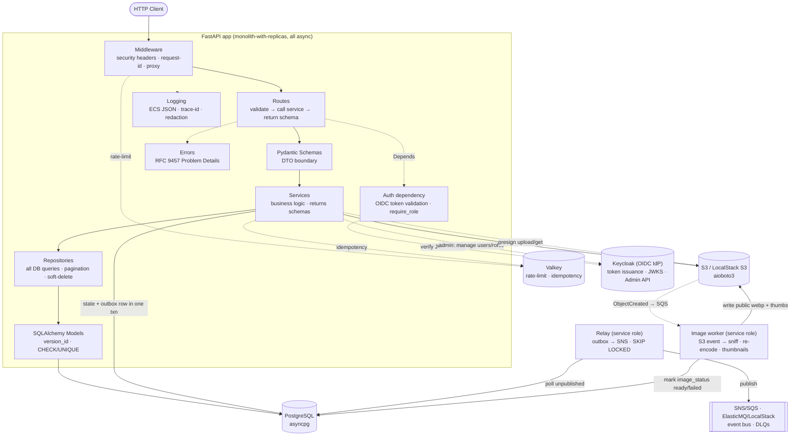

# Architecture

Async, API-first FastAPI e-commerce backend. **Monolith-with-replicas**: one
deployable service with a shared token-validation dependency across routers, run
as multiple identical ECS Fargate tasks behind an ALB. Identity is externalized
to **Keycloak (OIDC)**, so a future auth-service split is essentially free.

## Layered layout (`src/`)

```
src/
├── config/        # pydantic-settings (setting.py) + ECS JSON logging (logging.py)
├── clients/       # async infra clients (postgres, valkey, s3)
├── models/        # SQLAlchemy ORM models
├── repositories/  # all DB queries live here — routes/services never query directly
├── services/      # business logic; returns response schemas, never ORM models
├── routes/        # thin: validate (Pydantic) → call service → return response model
├── middleware/    # security headers, request-id, proxy headers
├── errors/        # RFC 9457 Problem Details (error_builder.py, exception_handlers.py)
├── admin/         # admin-only surface
└── container.py   # DI wiring: repositories/services instantiated once, injected via Depends
```

**Request flow — do not skip layers:** `Route → Schema → Service → Repository → Model`.



## Async is a top-to-bottom contract (the #1 risk)

Every route, service, and repository is `async def`. A single blocking sync call
in an async path silently serializes that endpoint under load. Offload
unavoidable blocking/CPU-bound work with `run_in_threadpool` /
`asyncio.to_thread`: Pillow re-encode + `python-magic` sniff (Phase 7), sync
`boto3`. Use `asyncio.sleep()`, never `time.sleep()`.
**Alembic stays sync** (sync `psycopg` driver in `env.py`).

## Auth model (OIDC resource server)

The app is a **pure OIDC resource server** — it never handles credentials or
login flows. **Keycloak** is the Identity Provider (free/OSS; a container locally,
a deployed service in any env). A separate frontend/SPA runs Authorization Code +
PKCE against Keycloak; the API only validates the tokens Keycloak issues.

- **Validate-only**: verify the Keycloak **RS256** access token against Keycloak's
  cached **JWKS** (`iss`/`aud`/`exp`), algorithm hardcoded (`alg:none` guard),
  public key only. Bearer token in the `Authorization` header → **no auth cookie,
  no CSRF surface**.
- **Two-tier principal**: `get_current_user` verifies the
  token and returns a claims-only `Principal(sub, email, roles)` — **no DB hit**;
  `get_current_db_user` does JIT + `is_active` and is wired only into routes needing
  the local `users.id`. A process-wide `PyJWKClient` (built in the lifespan) caches
  keys; its blocking fetch runs via `run_in_threadpool`. JWKS unreachable → **503**;
  bad/expired/tampered token → **401** (`WWW-Authenticate: Bearer`).
- **Roles** (`consumer` / `merchant` / `admin`, plus a `service` machine role) are
  **Keycloak realm roles** in the token (`realm_access.roles`) → RBAC is a cheap
  `Depends(require_role(...))` claim check on `Principal`, not a DB hit. Keycloak is
  the single source of truth for roles.
- **Local `users` row keyed by the OIDC `sub`**, JIT-provisioned race-safely
  (`INSERT ... ON CONFLICT (oidc_sub) DO UPDATE ... RETURNING`) on first
  authenticated request, anchors FK ownership (`products.merchant_id`,
  `orders.user_id`) + an `is_active` mirror — not the identity/role source. A
  disabled local row → **403**.
- **Row-level ownership** is enforced in the **service layer**: a `merchant` may
  mutate/soft-remove only items where `merchant_id == user.id`; the `admin` role
  **bypasses ownership** (but does not auto-satisfy an explicit `require_role`
  gate); `consumer` reads + orders.
- **Admin identity management** via Keycloak's **Admin API** (`python-keycloak`):
  create/disable users, grant/revoke the `merchant` role. The app stores no
  passwords.
- **Revocation = short access-token TTL (~5 min)** — a disabled user's token
  expires fast; no app-side denylist/introspection. Keycloak owns login, refresh,
  logout, password reset, email verification, MFA, and social federation.
- **Privilege guard is automatic**: new users get the default `consumer` realm
  role from Keycloak; the app cannot be asked to mint a role.

## Valkey usage

Ephemeral shared state **only**: rate-limit counters and idempotency keys (no JWT
`jti` denylist — Keycloak + short token TTL own revocation). Prod = ElastiCache
for Valkey replication group (Multi-AZ) so the one shared dependency isn't a SPOF.
Not for sessions/caching (product-listing read cache is a later watch-item).

## Domain events

Published through a **transactional outbox → SNS/SQS bus** (see ADR 0007), never
`BackgroundTasks` and never a direct SNS publish from the request path. The domain writes state
and an `outbox` row in **one transaction**; a `service`-role **relay** claims unpublished rows
(`FOR UPDATE SKIP LOCKED`), publishes them to SNS (**topic per event type**, **standard**
queues), then marks them published — publish-then-mark, so a crash re-ships (at-least-once).

Each consumer reads its own SQS subscription and is **idempotent**: it dedupes on the envelope
`event_id` in Valkey (best-effort, ~24h TTL) backed by an idempotent DB write, giving
**effectively-once** processing. Poison messages land in a **per-subscription DLQ** after N
retries (replay via SQS redrive — see RUNBOOK). W3C `traceparent` rides as an SQS message
attribute so one trace spans the queue hop.

## Correctness invariants (never simplify away)

- **Optimistic locking** on inventory via `Product.version_id` — prevents
  overselling.
- **Idempotent checkout**: `UNIQUE(user_id, idempotency_key)` on `Order` is the
  durable guard (Valkey only short-circuits fast retries).
- DB constraints belong in the DB: `UNIQUE(email)`, `CHECK(price > 0)`,
  `CHECK(stock >= 0)`, explicit `ON DELETE`.
- Uploads validated at the trust boundary: sniff real bytes (`python-magic`),
  re-encode images (Pillow) to strip EXIF.

## Errors, logging, security

- Errors: **RFC 9457 Problem Details** built via `src/shared/errors/error_builder.py`.
- Logging: ECS JSON to stdout, `contextvars` trace-id, `RedactFilter` scrubs
  secrets/PII. Never log passwords/tokens/JWT claims/PII.
- Security headers via custom ASGI middleware (HSTS, CSP, `X-Content-Type-Options`,
  `X-Frame-Options`). **No CSRF** — the Bearer token isn't an ambient cookie
  credential. CORS = explicit allow-list (the SPA origin); `allow_credentials`
  stays false with bearer-token auth.

## Extension points

- New resource = add model → repository → service → router, wired in
  `container.py`. Layers keep the change local.
- Auth-service split: identity already lives in Keycloak and the app only
  validates tokens against JWKS, so a separate issuer is a non-event.
- Read cache / search / additional workers are additive behind the existing
  service boundary.

## Deploy target

Docker image → ECR (tagged by git SHA, not `latest`) → **ECS Fargate**, behind an
ALB, multiple identical tasks. Alembic runs as a one-off migration task, not at
app boot. Terraform is the IaC. See [`DEPLOYMENT.md`](DEPLOYMENT.md).
